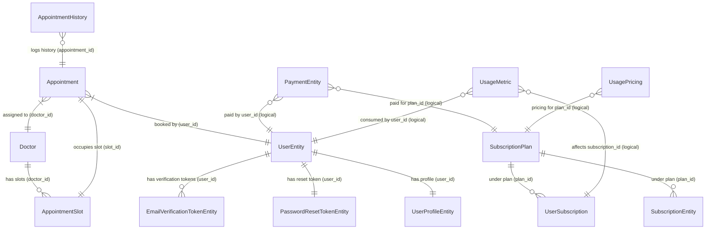

# Database Schema Documentation

This document describes the database schema of the **Healthcare Appointment and Subscription Management System**. The database holds information for user management, doctor scheduling, appointment bookings, subscription packages, quota usages, and payment histories.

---

## Entity-Relationship (ER) Diagram

---

## Schema Tables Detail

### 1. User Management Module

#### `UserEntity`
Stores authentication and basic information for users (patients, admins, etc.).

| Column Name | Data Type | Constraints / Attributes | Description |
| :--- | :--- | :--- | :--- |
| `id` | `BIGINT` | Primary Key, Auto-increment | Unique identifier for the user |
| `firstName` | `VARCHAR(255)` | - | User's first name |
| `lastName` | `VARCHAR(255)` | - | User's last name |
| `email` | `VARCHAR(255)` | - | User's email (used for login) |
| `password` | `VARCHAR(255)` | - | Bcrypt hashed password |
| `role` | `VARCHAR(255)` | - | User role (e.g., `ROLE_USER`, `ROLE_ADMIN`) |
| `isActive` | `BOOLEAN` | Default: `false` | Is the account active |
| `emailVerified` | `BOOLEAN` | Default: `false` | Is the email address verified |

#### `UserProfileEntity` (`user_profiles`)
Stores additional profile metadata for a user.

| Column Name | Data Type | Constraints / Attributes | Description |
| :--- | :--- | :--- | :--- |
| `id` | `BIGINT` | Primary Key, Identity | Unique profile ID |
| `user_id` | `BIGINT` | Foreign Key to `UserEntity` | Associated user account |
| `avatar` | `VARCHAR(255)` | - | Profile image URL or identifier |
| `bio` | `VARCHAR(255)` | - | User biography |
| `preferences` | `VARCHAR(255)` | - | JSON or comma-separated configuration string |

#### `AddressEntity`
Represents physical address info (stored standalone or referenced logically).

| Column Name | Data Type | Constraints / Attributes | Description |
| :--- | :--- | :--- | :--- |
| `id` | `BIGINT` | Primary Key, Identity | Unique Address ID |
| `streetAddress` | `VARCHAR(255)` | - | Street name and number |
| `city` | `VARCHAR(255)` | - | City name |
| `state` | `VARCHAR(255)` | - | State/Region name |
| `postalCode` | `VARCHAR(255)` | - | Postal/ZIP Code |
| `country` | `VARCHAR(255)` | - | Country name |

#### `PasswordResetTokenEntity`
Temporary tokens sent to users for resetting forgotten credentials.

| Column Name | Data Type | Constraints / Attributes | Description |
| :--- | :--- | :--- | :--- |
| `id` | `INTEGER` | Primary Key, Identity | Unique Token ID |
| `user_id` | `BIGINT` | Foreign Key to `UserEntity`, Not Null | Associated user |
| `token` | `VARCHAR(255)` | Not Null | Reset secure token |
| `expiryDate` | `TIMESTAMP` | Not Null | Date/time when token expires |

#### `EmailVerificationTokenEntity`
Temporary tokens used to verify email during user signup.

| Column Name | Data Type | Constraints / Attributes | Description |
| :--- | :--- | :--- | :--- |
| `id` | `BIGINT` | Primary Key, Auto-increment | Unique token record ID |
| `token` | `VARCHAR(255)` | - | Verification secure token |
| `user_id` | `BIGINT` | Foreign Key to `UserEntity`, Not Null | User being verified |
| `expiryDate` | `TIMESTAMP` | - | Expiration timestamp (default: 24h) |

---

### 2. Appointment Booking Module

#### `Doctor` (`doctors`)
Profiles of doctors available in the booking system.

| Column Name | Data Type | Constraints / Attributes | Description |
| :--- | :--- | :--- | :--- |
| `id` | `BIGINT` | Primary Key, Identity | Unique Doctor ID |
| `firstName` | `VARCHAR(255)` | Not Null | Doctor's first name |
| `lastName` | `VARCHAR(255)` | Not Null | Doctor's last name |
| `email` | `VARCHAR(255)` | Not Null, Unique | Professional email address |
| `specialization` | `VARCHAR(255)` | Not Null | Medical field (e.g. Cardiology) |
| `qualifications` | `VARCHAR(1000)` | - | Professional credentials |
| `experienceYears` | `INTEGER` | Not Null | Years of medical practice |
| `phoneNumber` | `VARCHAR(255)` | - | Contact number |
| `bio` | `VARCHAR(2000)` | - | Brief biography |
| `profileImageUrl` | `VARCHAR(255)` | - | Image asset URL |
| `isAvailable` | `BOOLEAN` | Not Null, Default: `true` | Availability state flag |
| `consultationFee` | `DOUBLE PRECISION` | Not Null | Appointment pricing |
| `createdAt` | `TIMESTAMP` | Not Null, Updatable: `false` | Registration timestamp |
| `updatedAt` | `TIMESTAMP` | Not Null | Last update timestamp |

#### `AppointmentSlot` (`appointment_slots`)
Time ranges during which a doctor is available for bookings.

| Column Name | Data Type | Constraints / Attributes | Description |
| :--- | :--- | :--- | :--- |
| `id` | `BIGINT` | Primary Key, Identity | Unique Slot ID |
| `doctor_id` | `BIGINT` | Foreign Key to `Doctor`, Not Null | Assigned Doctor |
| `slotStartTime` | `TIMESTAMP` | Not Null | Start of time range |
| `slotEndTime` | `TIMESTAMP` | Not Null | End of time range |
| `isBooked` | `BOOLEAN` | Not Null, Default: `false` | Flag indicating if booked |
| `isAvailable` | `BOOLEAN` | Not Null, Default: `true` | Flag indicating if slot is open |
| `createdAt` | `TIMESTAMP` | Not Null, Updatable: `false` | Creation timestamp |
| `updatedAt` | `TIMESTAMP` | Not Null | Last update timestamp |

* **Unique Key Constraint**: `(doctor_id, slot_start_time)` — Prevents duplicate slot generation for the same doctor at the same time.

#### `Appointment` (`appointments`)
Booked sessions connecting users, doctors, and specific time slots.

| Column Name | Data Type | Constraints / Attributes | Description |
| :--- | :--- | :--- | :--- |
| `id` | `BIGINT` | Primary Key, Identity | Unique Appointment ID |
| `user_id` | `BIGINT` | Foreign Key to `UserEntity`, Not Null | Patient user |
| `doctor_id` | `BIGINT` | Foreign Key to `Doctor`, Not Null | Assigned doctor |
| `slot_id` | `BIGINT` | Foreign Key to `AppointmentSlot` (1:1), Not Null | Selected time slot |
| `appointmentDate` | `TIMESTAMP` | Not Null | Exact appointment time |
| `status` | `VARCHAR(255)` | Not Null | Status (`SCHEDULED`, `CANCELLED`, `COMPLETED`) |
| `symptoms` | `VARCHAR(2000)` | - | Input symptoms description |
| `notes` | `VARCHAR(2000)` | - | Extra clinic notes |
| `prescription` | `VARCHAR(2000)` | - | Prescription details (when completed) |
| `cancellationReason` | `VARCHAR(1000)` | - | Reason for cancelling |
| `cancelledAt` | `TIMESTAMP` | - | Cancellation timestamp |
| `completedAt` | `TIMESTAMP` | - | Completion timestamp |
| `consultationFee` | `DOUBLE PRECISION` | Not Null | Amount charged |
| `isPaid` | `BOOLEAN` | Not Null, Default: `false` | Invoice payment status flag |
| `paymentId` | `VARCHAR(255)` | - | Transaction key reference |
| `notificationSent` | `BOOLEAN` | Not Null, Default: `false` | Status of Kafka event notifications |
| `createdAt` | `TIMESTAMP` | Not Null, Updatable: `false` | Creation date |
| `updatedAt` | `TIMESTAMP` | Not Null | Last update date |

#### `AppointmentHistory` (`appointment_history`)
Immutable log tracing history of status transitions for appointments.

| Column Name | Data Type | Constraints / Attributes | Description |
| :--- | :--- | :--- | :--- |
| `id` | `BIGINT` | Primary Key, Identity | Audit entry unique ID |
| `appointment_id` | `BIGINT` | Not Null | Logical reference to `Appointment` |
| `oldStatus` | `VARCHAR(255)` | Nullable | State before transition (`null` on creation) |
| `newStatus` | `VARCHAR(255)` | Not Null | State after transition |
| `changeReason` | `VARCHAR(2000)` | - | Reason explaining the change |
| `changedBy` | `VARCHAR(255)` | Not Null | Actor email or `"SYSTEM"` |
| `changedAt` | `TIMESTAMP` | Not Null, Default: `NOW()` | Timestamp of logging |

---

### 3. Subscriptions & Billing Module

#### `SubscriptionPlan` (`subscription_plans`)
Plans defining subscription pricing, cycle, quota allocations, etc.

| Column Name | Data Type | Constraints / Attributes | Description |
| :--- | :--- | :--- | :--- |
| `id` | `BIGINT` | Primary Key, Identity | Unique Plan ID |
| `planName` | `VARCHAR(255)` | Not Null, Unique | Name of the plan (e.g. Basic, Premium) |
| `description` | `VARCHAR(255)` | Not Null | Brief marketing description |
| `price` | `NUMERIC(19, 2)` | Not Null | Amount billed per cycle |
| `billingCycle` | `VARCHAR(255)` | Not Null | Cycle type (`MONTHLY`, `YEARLY`, `QUOTA`) |
| `trialDays` | `INTEGER` | Not Null, Default: `0` | Number of trial days offered |
| `active` | `BOOLEAN` | Not Null, Default: `true` | Is plan available for purchase |
| `features` | `VARCHAR(255)` | - | Comma-separated or JSON list of features |
| `tokenAllocation` | `NUMERIC(19, 2)` | Default: `0.0` | Credit/tokens allocated (for quota-based) |
| `isQuotaBased` | `BOOLEAN` | Default: `false` | Quota billing model flag |
| `validityPeriodMonths` | `INTEGER` | - | Valid timeframe for tokens |
| `createdAt` | `TIMESTAMP` | Not Null, Updatable: `false` | Entry creation time |
| `updatedAt` | `TIMESTAMP` | - | Last modification time |

#### `SubscriptionEntity` (`Subscription`)
Subscribed products and invoicing details for users.

| Column Name | Data Type | Constraints / Attributes | Description |
| :--- | :--- | :--- | :--- |
| `id` | `BIGINT` | Primary Key, Identity | Unique Subscription ID |
| `userId` | `BIGINT` | Not Null | Logical reference to subscriber user |
| `plan_id` | `BIGINT` | Foreign Key to `SubscriptionPlan`, Not Null | Associated product plan |
| `status` | `VARCHAR(255)` | Not Null | `ACTIVE`, `CANCELLED`, `EXPIRED`, `TRIAL` |
| `start_date` | `TIMESTAMP` | Not Null | Cycle start |
| `end_date` | `TIMESTAMP` | Not Null | Cycle end |
| `trial_end_date` | `TIMESTAMP` | - | Trial expiration date |
| `cancelled_at` | `TIMESTAMP` | - | Cancellation date |
| `amount` | `NUMERIC(19, 2)` | Not Null | Subscription rate |
| `payment_method` | `VARCHAR(255)` | - | Payment gateway method used |
| `transaction_id` | `VARCHAR(255)` | - | Successful transaction receipt code |
| `created_at` | `TIMESTAMP` | Not Null, Updatable: `false` | Record created date |
| `updated_at` | `TIMESTAMP` | - | Record updated date |

#### `UserSubscription` (`user_subscriptions`)
Current active plan states tracking remaining token quotas for API-based billing.

| Column Name | Data Type | Constraints / Attributes | Description |
| :--- | :--- | :--- | :--- |
| `id` | `BIGINT` | Primary Key, Identity | Unique record ID |
| `userId` | `BIGINT` | Not Null | Logical reference to user |
| `plan_id` | `BIGINT` | Foreign Key to `SubscriptionPlan`, Not Null | Subscribed plan details |
| `status` | `VARCHAR(255)` | Not Null | Status flag |
| `startDate` | `TIMESTAMP` | Not Null | Subscription start timestamp |
| `endDate` | `TIMESTAMP` | - | Subscription end timestamp |
| `trialEndDate` | `TIMESTAMP` | - | Trial period end |
| `cancelledAt` | `TIMESTAMP` | - | Cancellation timestamp |
| `autoRenew` | `BOOLEAN` | Not Null, Default: `true` | Auto-billing flag |
| `amount` | `NUMERIC(19, 2)` | Not Null | Billed rate |
| `paymentMethod` | `VARCHAR(255)` | - | Payment gateway type |
| `transactionId` | `VARCHAR(255)` | - | Gateway invoice code |
| `tokenQuota` | `NUMERIC(19, 2)` | Default: `0.0` | Maximum token allotment |
| `tokensConsumed` | `NUMERIC(19, 2)` | Default: `0.0` | Consumed amount |
| `tokensRemaining` | `NUMERIC(19, 2)` | Default: `0.0` | Remaining allotment |
| `quotaExhausted` | `BOOLEAN` | Default: `false` | Flag indicating if credit limit reached |
| `createdAt` | `TIMESTAMP` | Not Null, Updatable: `false` | Registration timestamp |
| `updatedAt` | `TIMESTAMP` | - | Last update timestamp |

#### `UsageMetric` (`usage_metrics`)
Aggregated usage history for billing calculations.

| Column Name | Data Type | Constraints / Attributes | Description |
| :--- | :--- | :--- | :--- |
| `id` | `BIGINT` | Primary Key, Identity | Unique record ID |
| `userId` | `BIGINT` | Not Null | Logical reference to user |
| `subscriptionId` | `BIGINT` | Not Null | Logical reference to active subscription |
| `usageType` | `VARCHAR(255)` | Not Null | Category (`APPOINTMENT`, `API_CALL`, `STORAGE`) |
| `quantity` | `NUMERIC(19, 2)` | Not Null | Amount consumed |
| `unitPrice` | `NUMERIC(19, 2)` | Not Null | Charge per unit |
| `totalCost` | `NUMERIC(19, 2)` | Not Null | Cost: `quantity * unitPrice` |
| `description` | `VARCHAR(255)` | - | Specific entry description |
| `recorded_at` | `TIMESTAMP` | Not Null | Creation/logging time |
| `billing_period_start` | `TIMESTAMP` | - | Billing cycle start |
| `billing_period_end` | `TIMESTAMP` | - | Billing cycle end |
| `billed` | `BOOLEAN` | Not Null, Default: `false` | Flag indicating if invoiced/paid |

#### `UsagePricing` (`usage_pricing`)
Defines how custom units of service consumption are priced per plan.

| Column Name | Data Type | Constraints / Attributes | Description |
| :--- | :--- | :--- | :--- |
| `id` | `BIGINT` | Primary Key, Identity | Unique record ID |
| `planId` | `BIGINT` | Not Null | Logical reference to `SubscriptionPlan` |
| `usageType` | `VARCHAR(255)` | Not Null | Usage category type |
| `unitPrice` | `NUMERIC(19, 2)` | Not Null | Cost per single unit |
| `includedQuantity` | `NUMERIC(19, 2)` | Default: `0.0` | Free allowance included in plan |
| `unit` | `VARCHAR(255)` | - | Unit label (e.g. `"per call"`) |
| `active` | `BOOLEAN` | Not Null, Default: `true` | Is this metric active for billing |

---

### 4. Payments Module

#### `PaymentEntity` (`Payment`)
Records all transaction receipts handled via Razorpay or Stripe.

| Column Name | Data Type | Constraints / Attributes | Description |
| :--- | :--- | :--- | :--- |
| `id` | `BIGINT` | Primary Key, Identity | Unique Payment ID |
| `userId` | `BIGINT` | Not Null | Logical reference to the buyer |
| `subscription_id` | `BIGINT` | - | Logical reference to user subscription |
| `plan_id` | `BIGINT` | - | Logical reference to plan purchased |
| `paymentGateway` | `VARCHAR(255)` | Not Null | Gateway type (`RAZORPAY` / `STRIPE`) |
| `transactionId` | `VARCHAR(255)` | Not Null, Unique | Unique payment transaction ID from gateway |
| `order_id` | `VARCHAR(255)` | - | Session/Order ID from gateway |
| `amount` | `NUMERIC(10, 2)` | Not Null | Price billed |
| `currency` | `VARCHAR(255)` | Not Null | Currency tag (e.g., `USD`, `INR`) |
| `status` | `VARCHAR(255)` | Not Null | State (`SUCCESS`, `FAILED`, `PENDING`) |
| `payment_method` | `VARCHAR(255)` | - | Method type (card, upi, bank) |
| `plan_name` | `VARCHAR(255)` | - | Name of plan paid for |
| `plan_description` | `VARCHAR(500)` | - | Description of plan |
| `signature` | `VARCHAR(255)` | - | Verification HMAC signature (Razorpay) |
| `payment_date` | `TIMESTAMP` | - | Payment success timestamp |
| `error_message` | `VARCHAR(500)` | - | Failure explanation context |
| `created_at` | `TIMESTAMP` | Not Null, Updatable: `false` | Insertion timestamp |
| `updated_at` | `TIMESTAMP` | - | Last modification timestamp |

---

### 5. Administrative Module

#### `AdminSettings` (`admin_settings`)
Global key-value system configurations for administrator controls.

| Column Name | Data Type | Constraints / Attributes | Description |
| :--- | :--- | :--- | :--- |
| `id` | `BIGINT` | Primary Key, Identity | Unique Setting ID |
| `settingKey` | `VARCHAR(255)` | Not Null, Unique | Config variable key (e.g., `MAX_APPOINTMENTS_PER_DAY`) |
| `settingValue` | `VARCHAR(255)` | Not Null | Config value |
| `description` | `VARCHAR(255)` | - | Explanatory description |
| `updated_at` | `TIMESTAMP` | - | Last modification date |
| `updated_by` | `VARCHAR(255)` | - | Admin user email |
